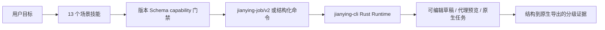

# jianying-skills

通过统一 Rust 运行时 `jianying-cli` 创建、编辑、检查、恢复和导出剪映/CapCut 草稿的 Agent Skills。

简体中文 | [English](README.md)

## 架构

技能不实现第二套剪辑引擎，只把用户意图编译为 `jianying-job/v2` 或结构化 CLI 命令，
再由 `jianying-cli` 或承载插件的 Rust Runtime Adapter 执行。



技能不会生成临时草稿脚本、加载旧的内嵌引擎，也不会把执行路由到外部 headless checkout。
capability 为 `partial`、`external_dependency` 或缺失时，受影响工作流必须停止并给出诊断。

## 安装

安装全部技能：

```bash
npx skills add full-aigc-skills/jianying-skills
```

粒度安装单个技能：

```bash
npx skills add full-aigc-skills/jianying-skills --skill jianying-edit
```

每个技能都自带 workflow reference 和最小 Job 示例，不依赖兄弟技能目录。

## 13 个技能

| 技能 | 职责 |
|---|---|
| `jianying-use` | 统一入口、最小询问和 capability 诊断 |
| `jianying-setup` | CLI、媒体工具、草稿根、配置和 Runtime Profile |
| `jianying-draft` | `jianying-job/v2`、领域概念和 v1 兼容 |
| `jianying-harness` | 持久任务、审批、配置、MCP 和宿主契约 |
| `jianying-edit` | 新建草稿和已有草稿隔离编辑 |
| `jianying-narration` | ASR 账本与口播精剪 |
| `jianying-subtitles` | 字幕导入、编辑、样式、翻译和导出 |
| `jianying-audio` | 音频分层、音量、淡入淡出、音效、重链和 TTS 门禁 |
| `jianying-motion` | 变换、关键帧、动画、速度和帧量化 |
| `jianying-transitions` | 基于目录的转场选择和边界检查 |
| `jianying-inspect` | 只读素材/草稿事实和证据分级 |
| `jianying-export-prep` | 代理/原生导出门禁和制品验证 |
| `jianying-recover` | 任务审计、显式重试、快照和 ambiguous 操作 |

## 兼容性与证据

目标契约要求 `jianying-cli >= 1.6.0`，但实际路由始终以 capability manifest 为准。
每个技能声明所需 capability、风险等级、确认点和最高完成证据。结构通过不等于冷重开、播放或原生导出通过。

capcut-cli 86 项命令的完整能力审计由
[`jianying-cli`](https://github.com/full-aigc-plugins/jianying-cli/blob/main/docs/capcut-command-evidence.md)
集中维护，技能不重复复制整张表。

## 分发

本仓是技能正文的唯一事实源。插件只能消费不可变发布 ref 和 commit，校验 13 个技能逐目录摘要，
不得在 vendored 副本中独立修补正文。

## 许可

本仓采用 Apache-2.0。来源、声明义务和排除输入见 [THIRD_PARTY_NOTICES.md](THIRD_PARTY_NOTICES.md)。
