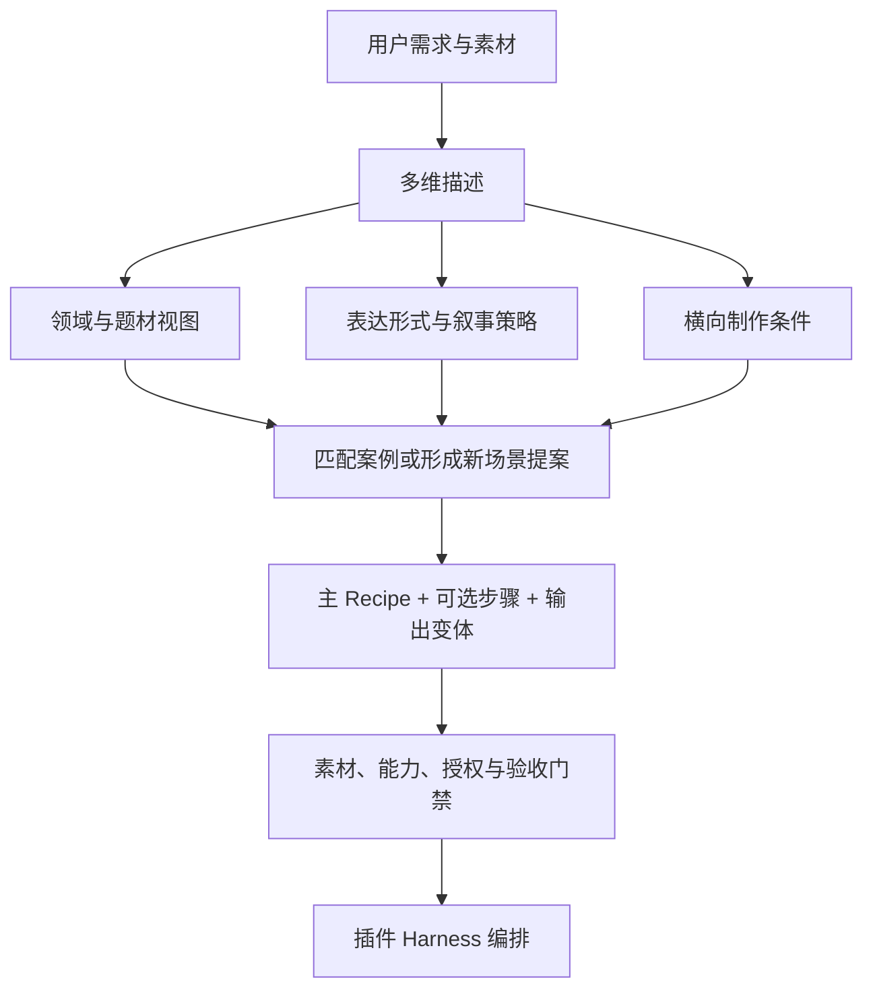

# 开放视频场景覆盖计划

状态：规划草案，2026-09-21。目标是覆盖可识别需求并持续接纳新场景，不声称穷尽世界上的视频类型。
本文是场景知识规划的唯一维护入口；不是运行时目录，不修改已发布技能的能力声明。

## 1. 本轮决策与交付边界

1. 18 类、108 个 example 定位为第一批种子案例，不再作为产品类型上限。
2. 采用多维标签而非唯一分类树；行业、形式、渠道、制作技术、交付要求分开表达。
3. 已知场景检索、混合场景组合、未知场景提案三条路径并存；未知不等于不能规划。
4. 本版覆盖审计列出 40 个领域视图和 20 个横向制作需求；两张清单都允许增长。
5. 内容收录、方法参考、可编排、CLI 可执行、真实成片和宿主验收分别统计。
6. 保留全部既有 ID、来源、example 和 Release；开放目录实现以 v2 增量发布，不改写冻结 v1。

阅读顺序：本计划 → [108 个种子映射](SEED_MAPPING.md) → [来源证据](RESEARCH_SOURCES.md)。
插件执行设计见 [开放场景编排计划][plugin-plan]；不在此复制任务状态机或实现第二套执行器。

现有规格仍是 `add-video-planning-skill`；本文是其后续演进规划，不追加已勾选任务，
也不把本次研究记为第二批技能已发布。实施前按第 11 节形成新的增量规格。

## 2. 为什么不能继续堆单层分类

“婚礼”是题材，“纪录片”是表达形式，“广告”是用途，“竖屏”是呈现约束，
“多机位”是素材条件，“原生导出”是交付要求，不能放在同一层当作互斥类型。

同一份婚礼素材可以形成全程记录、私人纪念、摄影教学或婚庆广告。
其中某些目标需要不同的剪辑任务，而非在同一片子中无条件混合所有 Recipe。

下面的 40 个领域是**审计视图，不是新的互斥分类树**；一个场景允许落入多个领域。
题材名称增加，只有确实改变素材、流程、风险或验收时才值得新增独立 example。

## 3. 十二个规划维度

| 维度 | 需要回答的问题 | 开放取值示例 |
| --- | --- | --- |
| A01 用途 | 用户希望达成什么？ | 纪念、完整记录、娱乐、教学、解释、转化、归档 |
| A02 受众 | 谁观看，具备什么先验？ | 亲友、新手、专业人员、客户、儿童、特定语言群体 |
| A03 领域题材 | 内容发生在什么领域？ | 婚礼、宠物、制造、医疗、游戏；可多选 |
| A04 表达形式 | 观众看到怎样的作品？ | Vlog、访谈、纪录、演示、剧情、动画、合集、环境声 |
| A05 叙事结构 | 信息如何展开？ | 时间顺序、问题解决、人物弧线、对比、步骤、非线性 |
| A06 素材条件 | 实际有哪些输入？ | 手机、多机、录屏、照片、档案、音频、渲染、生成视频 |
| A07 声画策略 | 谁主导节奏？ | 对话主导、音乐主导、现场声、无声观看、旁白、混合 |
| A08 风格节奏 | 创意偏好是什么？ | 克制纪实、电影感、轻松、快切、长镜头；非技术能力 |
| A09 渠道与观看环境 | 怎样观看与分发？ | 信息流、长视频、课程、私域、展厅、放映；规格另核验 |
| A10 时效与交互 | 是否实时或由用户分支选择？ | 录播、直播后剪辑、当日快剪、互动、循环播放 |
| A11 约束与授权 | 哪些内容和操作受限制？ | 版权、隐私、商业、事实审核、无障碍、预算、设备 |
| A12 交付与证明 | 到什么程度算完成？ | 提案、草稿、预览、原生影片、多版本包、证据附件 |

实施时应区分“用户给定、媒体探测、模型推断、人工确认、未知”，并记录每项依据。
不得把未知值默认成低风险，不得凭文件名补齐媒体事实。
多维组合空间不是要全部生成的笛卡尔积；应按真实需求、冲突组合和高风险边界选评测样本。

## 4. 已有 108 个案例的继承策略

- ID 和文件路径稳定：现有 `VG01` 等仍有效，旧链接、来源与快照可追溯。
- 原 `family` 保留为 legacy 导航视图；新增维度不直接覆盖旧字段含义。
- 单一 Recipe 绑定保留兼容读取；新编排由版本化扩展描述，不能靠拼接字符串偷偷升级。
- [种子映射](SEED_MAPPING.md) 列出全部 108 个 ID、例文和建议主要领域；不是已完成十二维标注。
- 某领域有一个种子，只代表局部内容起点，不代表该领域所有子任务已覆盖。
- 没有独立案例的领域可以借鉴方法，但不能标记“已支持”；尤其不能用通用教学替代医疗审核。

冻结 v1 仍保持 108 个场景、18 家族、每家族 6 项、12 Recipe；v2 加载与验证已解除这些固定数量假设，
并以 1、109、1000 项非均分 fixture 验证扩容。旧消费者继续读取 v1；未知版本和不完整 v2 明确失败，
不能静默回退或把测试目录当正式知识。

## 5. 四十个领域的覆盖审计

“已有”仅指当前目录有直接种子；“邻近”表示可借鉴，尚无领域专属方案。
“待补场景”均为本轮规划候选，不是逐项完成研究、编写或实机验证的新增 example。
来源编号见研究台账；未列来源的扩展是编辑判断，后续须逐场景补证，不能宣传为热门实操。

### 5.1 生活、关系与消费体验

| ID / 领域 | 已有内容起点 | 待补场景与差异 | 验收重点 |
| --- | --- | --- | --- |
| D01 个人生活 | VG01–06 | 周/月回顾；生活重启；独居日常；无旁白日记；年度总结 | 真实变化与隐私 |
| D02 旅行城市 | TR01/02/05 | 美食路线；公共交通旅行；亲子行程；无障碍旅行；预算复盘 | 路线与事实对应 |
| D03 户外冒险 | TR03/04/06 | 骑行旅程；潜水；滑雪；航拍旅行；探险回顾；装备准备 | 不鼓励危险模仿 |
| D04 婚礼关系 | WD01–06 | 婚前成长片；远程祝福；亲友版；跨文化仪式；婚礼幕后 | 人物关系与仪式完整 |
| D05 家庭生命 | FM01–06 | 孕期纪念；长辈口述；家庭迁徙；旧照片配声；宠物纪念 | 授权与年代准确 |
| D06 校园校友 | VG03/FM03 | 招生参观；社团招新；研学记录；校友访谈；校园典礼 | 未成年人及校方授权 |
| D07 美食餐饮 | PR01/02 | 烘焙步骤；街头美食；餐厅纪录；食材对比；备餐；厨艺失败复盘 | 步骤、用量与体验真实性 |
| D08 宠物动物 | 邻近 DC05 | 宠物日常；训练进展；领养故事；宠物视角；救助后续；护理过程 | 动物福利与行为解释 |
| D09 时尚美妆 | PR05 | 穿搭合集；衣橱整理；发型改造；试色对比；服装走秀；妆容教学 | 同条件对比与效果边界 |
| D10 居家收纳 | VG06/SP04 | 房间整理；租房改造；家庭清洁；搬家前后；家务流程 | 前后场景条件可比 |
| D11 手工维修 | PR03/04 | 木工；模型制作；电子维修；旧物修复；陶艺；缝纫 | 关键工序、工具与安全 |
| D12 园艺农业 | PR06 | 生长延时；阳台种植；播种到收获；农场日记；农产品溯源 | 时间跨度与产地事实 |

D08 的独立性由宠物拍摄实践资料 S12 支持；它不能仅作为“自然观察”的改标题版。
其他扩展主要从现有案例的素材和验收差异推导，仍待逐项调查。

### 5.2 体育、产品、空间与商业

| ID / 领域 | 已有内容起点 | 待补场景与差异 | 验收重点 |
| --- | --- | --- | --- |
| D13 体育健身 | SG01/02/03 | 全场录像；训练复盘；跟练课；动作对比；赛事预告；康复专家示范 | 动作完整、专业复核 |
| D14 游戏电竞 | SG04/05/06 | 长实况章节；速通解析；版本评测；赛事复盘；游戏剧情回顾；战队招募 | 版本、上下文与素材许可 |
| D15 数码硬件 | PD01/02/03/05 | 长期体验；实验室测试；配件选购；拆解；同价对比；故障排查 | 测试条件、数据与利益披露 |
| D16 软件与 AI | PD04/05/06/AD05 | 开发演示；复杂操作课；AI 实测；功能迭代日志；安装排错 | 版本、隐私与实际输出 |
| D17 汽车出行 | SP06/TR03 | 试驾；养护；车辆交付；车展；公共交通观察；改装前后 | 真实条件和行车安全 |
| D18 房产建筑 | SP01/03/04 | 工程进度；空间动线；施工复盘；设计方案展示；验房说明 | 不误导尺度、进度与缺陷 |
| D19 酒店本地服务 | SP02/AD06 | 住宿体验；服务流程；门店开业；到店路线；设施无障碍介绍 | 承诺与实际设施一致 |
| D20 商业品牌 | BR01/02/03/06 | 客户成功；品牌宣言；招投标介绍；年度成果；伙伴故事 | 主张、授权与数据来源 |
| D21 广告销售 | AD01–06 | 获客变体；再营销；众筹介绍；销售提案；季节推广；使用证言 | 单一诉求、披露与审批 |
| D22 招聘与组织 | BR04/CO01/06 | 岗位介绍；团队日常；管理沟通；远程入职；员工故事 | 保密信息与代表性 |
| D23 培训与服务 | CO02/03/04/05 | 故障排查树；服务交接；版本升级培训；客户案例讲解；知识交接 | 前提、步骤与版本有效性 |
| D24 活动会议 | EV01–05 | 网络研讨会回放；分会场合集；奖项短片；招商预告；观众反馈 | 完整发言与时间线 |

S01 为企业视频用途差异提供依据；S03 支持渠道对广告组织方式的影响。
不将来源中的营销效果、片长建议或平台规格固化为我们所有场景的硬规则。

### 5.3 公共知识、专业领域与叙事艺术

| ID / 领域 | 已有内容起点 | 待补场景与差异 | 验收重点 |
| --- | --- | --- | --- |
| D25 公益社区 | EV06/BR05/DC04 | 筹款；志愿者招募；受益人故事；项目问责；社区行动回顾 | 尊严、同意与资金事实 |
| D26 教育技能 | ED01/02/03/05 | 白板课；课堂回放；师训；语言跟读；操作考核；错题复盘 | 可跟做且知识正确 |
| D27 科学科研 | ED04/06/NW03 | 论文视频摘要；实验记录；天文观察；数据可视化；科研演示 | 原始数据与可复现步骤 |
| D28 医疗健康 | 无专属；邻近 ED04 | 患者宣教；就诊流程；医护培训；专家讲解；模拟病例；设备培训 | 专业审核、去标识与同意 |
| D29 财经金融 | 无专属；邻近 NW03 | 财报解释；金融素养；商业案例；风险教育；市场回顾 | 数据时点、限制与专业审核 |
| D30 法律政务 | 无专属；邻近 NW04 | 办事流程；公共服务说明；法律常识；会议公开记录；政策问答 | 辖区、时效、引用与审核 |
| D31 新闻事实 | NW01–06 | 突发后续；事实核查过程；采访混剪；地方解释报道；数据更新版 | 不扭曲语境，保留未知 |
| D32 纪录历史 | DC01–06 | 口述史；调查纪录；档案对照；历史地点复访；迁徙故事 | 来源、再现与原始影像区分 |
| D33 访谈播客 | IV01–06 | 单人独白；远程访谈；听众问答；主题合辑；多语种访谈 | 句意、说话人、同步 |
| D34 剧情影视 | ST01–06 | 短剧系列；悬疑；喜剧节奏；实验影像；微电影；授权评论解析 | 连续性、表演与版权 |
| D35 音乐表演 | MU01–06 | 排练纪录；现场录音；合奏；舞台多机；舞蹈教学；音乐可视化 | 音乐主轨、同步与权利 |
| D36 艺术文化 | DC03/SP05 | 展览宣传；作品阐释；艺术家创作；博物馆教育；非遗教学 | 作者、作品与文化语境 |
| D37 动画设计 | 无专属；邻近 VG04 | 二维短片；三维动画；定格；动态设计；分镜预演；动画作品集 | 外部资产链与帧时序 |
| D38 民俗信仰 | 无专属；邻近 EV05 | 节庆记录；仪轨档案；传统仪式解说；社群口述；文化交流 | 社群确认与尊重性表达 |
| D39 产业供应链 | 邻近 CO02/03/DC02 | 产线演示；设备维护；工序培训；物流流程；质量复盘；技术交接 | 工序、安全与商业秘密 |
| D40 环境自然 | DC05/TR06/PR06 | 物候观察；生态调查；保护项目；自然声景；修复前后；环境解释 | 地点隐私、物种与数据 |

S05/S06 支持制造与医疗需要独立培训约束；S08 支持纪录研究；S10 支持公益用途差异；
S11 支持定格不是普通短片标签。D29/D30/D38 等目前主要是需求候选，专门来源仍待补。
以上是剪辑规划，不提供诊断、投资或法律结论，也不宣称自动完成专业审查。

## 6. 二十个横向制作需求

这些需求可跨越全部领域，不能再按题材重复造大量同义场景。
X 编号是本规划的工作包 ID，不是新的 CLI capability 或运行时 scene_id。

| ID / 横向需求 | 改变什么 | 必须新增的检查 |
| --- | --- | --- |
| X01 长内容拆条 | 一个母版、多主题短片 | 语境、母子版本、片段来源 |
| X02 多渠道改版 | 画幅、构图、字幕、节奏、片长 | 主体安全区、每版独立验收 |
| X03 多语言本地化 | 转写、译文、字幕、配音 | 术语、时长、语言审校与声音授权 |
| X04 无障碍交付 | 声音说明字幕、音频描述、手语画面、文本稿 | 不以普通字幕代表所有需求 |
| X05 多机位同步 | 时钟偏移、主音轨、机位选择 | 漂移、口型、切换连续性 |
| X06 录屏与讲师合成 | 操作重点、讲师小窗、放大提示 | 可读性、敏感信息、版本 |
| X07 照片与档案 | 扫描图、历史录音、老视频、出处 | 年代、修复范围、来源区别 |
| X08 延时与慢动作 | 长时间压缩或动作展开 | 时间标识、真实速率、音轨处理 |
| X09 音乐节拍与歌词 | 主音乐轴、动作、歌词时序 | 节拍标记、歌词权利、同步 |
| X10 环境声与循环 | 声景、ASMR、冥想、无缝循环 | 底噪、循环接点、突发响度 |
| X11 动画与图表 | 外部二维/三维/数据图表资产 | 数据来源、透明通道、帧率 |
| X12 AI 生成素材 | 提示、提供方、生成片段、合成来源 | 预算、真实性标记、人物与声音授权 |
| X13 全景与沉浸式 | 180/360、立体、空间音频 | 拼接、投影、元数据、目标播放器 |
| X14 互动与分支 | 分支片段、导航和播放器 | 外部交互运行时；MP4 不等于互动产品 |
| X15 直播后制作 | 回放清理、章节、片段和多版本 | 录制完整性；不宣称实时导播能力 |
| X16 当日快剪 | 截止时间、滚动素材、并发审阅 | 截止点冻结、单写、快速批准 |
| X17 批量变体 | 商品、门店、人群或语言变体 | 模板变量、单项失败隔离、成本上限 |
| X18 脱敏与受控审阅 | 人脸、证件、屏幕和访谈隐私 | 检测不是自动合规证明，需复核 |
| X19 档案保真与取证副本 | 原始文件、可复现剪辑、操作记录 | 保留原件，不认证司法可采性 |
| X20 多人审片与修订 | 时间码意见、版本、批准与回退 | 评论绑定版本，旧批准不继承 |

来源支撑：S02 多形式；S03 渠道化；S04 无障碍；S07 直播题材跨度；S09 全景交付。
其他横向需求来自工作流风险分解，能力实现与逐项实操来源均另行验证。

## 7. 场景卡与覆盖状态

### 7.1 建议场景卡字段

字段是下一版合同设计，不可直接传给现有 `jianying-video-intent/v1`。

| 分组 | 必要记录 |
| --- | --- |
| 身份 | 稳定 ID、名称、别名、语言、旧 ID、版本、维护者 |
| 适用范围 | 十二维标签、适用/不适用条件、用户目标与反例 |
| 素材 | 必需、可选、可替代素材；缺素材处理；语义判断来源 |
| 方法 | 主 Recipe、横向需求、步骤、输入输出、确认点、停止条件 |
| 能力 | 原子 capability、外部依赖、人工判断、交付证明要求 |
| 来源 | URL、检索词、读取日期/范围、方法证据、热度证据、许可边界 |
| 验收 | 特有硬门禁、创作标准、失败用例、fixture 和实际证据引用 |
| 演进 | 状态、差距、已知限制、替代关系、废弃原因与迁移路径 |

新增 ID 建议使用可扩展命名空间，例如 `scene.pet.adoption_story`，保留旧短 ID 别名。
具体格式需正式 Schema 评审；当前正则仍只接受两个大写字母加两位数字，不能立即使用建议 ID。

### 7.2 不把覆盖压成一个百分比

每个场景分别记录以下状态，不能自动相互推导：

- `catalogue`：候选 / 已收录 / 废弃；衡量是否有内容入口。
- `research`：待研究 / 方法来源已核对 / 待更新；热度单独记录。
- `recipe`：提案 / 可编译方案 / 已有编排测试；不等同于成片。
- `runtime`：未握手 / 能力阻断 / 本环境能力通过；与版本和平台绑定。
- `media_acceptance`：无 fixture / 结构 / 预览 / 真实剪映分项证据。
- `host_acceptance`：按 Codex、ZCode、Kimi 分别记录，不默认继承。

报告分母应是“本次批准的目标清单”，不是“全世界视频”。
例如“某批候选 20 项，其中 8 项完成方法研究”可以核实；“全球覆盖 95%”没有可靠分母。
优先级按用户需求、可复用价值、风险与能力缺口排序，不用人为平均每类数量。

## 8. Recipe 组合规则

现有 R01–R12 保留为叙事策略库。新工作流由一个主要叙事目标、若干横向步骤和输出变体组成。
不是把多个 Recipe 的文案连接起来，就算工作流已经可执行。

| 组合 | 主策略与附加步骤 | 冲突处理 |
| --- | --- | --- |
| 婚礼全程 + 私人短片 | R03 母版；另派生 R02 纪念版；X05 多机、X01 拆条 | 两个交付任务；短片不能覆盖全程 |
| 宠物领养故事 | R08 事实叙事 + R02 情绪段落；X18 隐私复核 | 不虚构经历；事实优先于煽情 |
| 多语种软件培训 | R06 教学 + R05 演示；X06 录屏、X03 本地化、X04 无障碍 | 先确认术语和操作，再做节奏压缩 |
| 制造工序培训 | R06；X05 同步、X06 标注、X20 专家审片 | 安全工序不可为短片时长而删除 |
| 博物馆沉浸导览 | R12 空间 + R08 事实；X13 全景、X04 无障碍 | 先检查外部交付链；不可降成普通视频冒充 |
| 公益活动多渠道包 | R08 母版；R04 行动号召版；X01/X02/X03 | 审核受益人授权、资金事实与各版诉求 |

流程组合的可执行合同由插件规划维护；技能只提供可解释策略、约束和验收。
未具备能力时允许交付方法提案，但执行必须明确等待或阻断。

## 9. 研究与收录工作流

1. 从覆盖差距、真实用户需求、公开实践发现候选，不以热点榜单代替需求研究。
2. 查重：别名、题材换皮归入现有场景；素材、流程、风险或验收有实质差异才新增。
3. 逐场景检索原作者、平台官方或实际制作案例，记录查询和阅读范围。
4. 分开评价方法依据与热度；有文章不等于热门，有热度不等于可复现。
5. 独立编写 example，映射既有技能和真实 capability；外部/人工职责单列。
6. 设计合法合成或获准素材 fixture，先完成离线合同与负向用例，再安排真实成片。
7. 内容评审后进入技能 Release；插件通过正式版本锁消费，不直接读取开发目录。
8. 平台或案例失效时保留历史出处，标记待更新并补替代来源，不改写旧验收事实。

每个新增 example 至少回答：用户目标、素材要求、特有步骤、具体取舍、失败处理、
人工/模型边界、技能/能力映射、验收和来源。只有换标题的复制模板不计为新增覆盖。
S01–S12 是分类研究证据，不替代所有候选各自的实操来源。

## 10. 评估采样与规划完成标准

内容层先覆盖所有当前 108 项的兼容回归，再按新差异建立样本：

- 分类：明确、歧义、别名、多领域、全新题材、相互矛盾要求。
- 组合：单 Recipe、多步骤、多交付、跨渠道、跨语言、能力缺失。
- 媒体：无素材、照片、纯音频、录屏、多机、混合帧率、损坏素材、授权不明。
- 风险：未成年人、专业内容、商业主张、隐私、付费、真实应用控制。
- 边界：互动、实时导播、全景等暂未验证交付不得伪装成普通 MP4 成功。

不穷举所有标签组合，使用关键冲突用例加成对组合覆盖；高风险路径另做定向验证。
可复用素材不等于可复用成片证据：同素材做婚礼广告和私人纪念仍需各自验收。

本轮“规划完成”定义：已有案例不丢失、已知差距入账、开放路由有设计、能力责任清楚、
研究证据边界明确、实施顺序与验收可执行；不是所有候选已写成技能或已生产就绪。

## 11. 实施批次与责任

以下均是未执行的后续工作包，不能据此修改现有 OpenSpec 已完成计数。

| 批次 | 主责 | 内容 | 进入下一批的条件 |
| --- | --- | --- | --- |
| W0 规格与兼容 | Skills + 插件 | 新目录/输出合同、旧 ID、版本协商、计数解耦 | 规格批准、旧 108 回归和负向测试定义完成 |
| W1 开放选型 | 插件 | 多维意图、混合需求、未知场景提案、可解释路由 | 无未知硬套、不虚构素材、无授权旁路 |
| W2 代表性增量 | Skills + 插件 | 宠物、直播后制作、多语课程、制造培训、无障碍、公益包 | 来源、独立例子与能力缺口 |
| W3 可执行桥接 | 插件 + CLI | 选片账本、组合编译、批准、产物证据 | 真实素材代表链通过；不靠 Rust 源码临时补能力 |
| W4 扩展覆盖 | Skills | 按 D/X 差距逐批研究与写例，专业领域先过审 | 每批明确分母、来源、能力和验收状态 |
| W5 特殊交付 | CLI + 外部工具 + 插件 | 全景、互动、实时相关、多设备等评估 | 依赖/授权/协议与真实交付验收通过 |

W2 不意味着自动实现 ASR/TTS、模型语义识别、专业审核或原生导出。
任何批次涉及技能正文时，仍须不可变发布、逐目录摘要和插件锁定消费。
主责是仓库/角色归属，不是已指定具体人员或截止日期。

## 12. 尚待确认与刻意不做的事

- 未逐条完成所有新候选的网上实操调查，不虚构热度和完整视频观看记录。
- D29/D30/D38 的专门来源与专业领域评审人待落实；来源不足留候选状态。
- 不自动采集用户私人视频作为训练/评测集，不上传媒体、不付费调用模型。
- 不新增运行时 ID、不升级技能版本、不改插件锁、不发布。
- 不把“全量规划”承诺成“任何内容都能自动完成”；不支持的能力仍保留拒绝路径。

## 13. 本轮规划校验记录

2026-09-21：12 个维度、40 个领域、20 个横向需求与 12 条研究来源计数一致；
108 个种子映射逐项匹配原目录的 ID、名称和 Recipe，例文文件均存在。
跨仓文档引用按本地工作区检查，目标存在；新增文档尚未推送，线上链接需发布后再验收。
新规划文档 Markdown 检查及两仓既有 OpenSpec 严格校验通过；插件规划回归 114 项通过。
Mermaid 代码块结构已检查，未执行图形渲染验收；未增加运行时或真实剪映验收证据。

[plugin-plan]: https://github.com/full-aigc-plugins/jianying-edit-plugin/blob/main/docs/video-harness/OPEN_SCENARIO_PLAN.md
