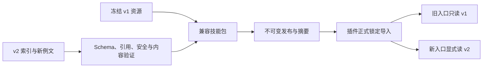

# 开放目录设计

## Context

动机见 [proposal](proposal.md)。当前知识由多个 v1 JSON 与 108 篇例文组成，插件与内容测试固定计数。
既有 [覆盖计划](../../../docs/video-scenarios/COVERAGE_PLAN.md) 是研究输入；
目录行为以本变更的 [目录合同](specs/open-scenario-catalog/spec.md) 为准。
本文件选择双资源兼容，不修改或重解释旧版文件。

## Goals / Non-Goals

**Goals:** 让新版消费者读取合法的任意规模目录（在资源限额内），同时保留旧消费视图与来源。

**Non-Goals:** 不开发工作流执行器，不把全量候选立即转成正式例文，不以 fixture 冒充真实案例。

## Decisions

### D1 双资源而不是原地替换

选择保留现有 v1 路径及内容，新增
`skills/jianying-video-planning/references/planning-catalog-v2.json`，
schema 固定为 `jianying-planning-catalog/v2`。这是待实现路径，不是当前已存在资源。

| 消费者与请求 | 包只有 v1 | 包含冻结 v1 + 新 v2 |
| --- | --- | --- |
| 已发布旧插件 | 原有行为 | 锁定导入后仍读 v1，看到 108 项 |
| 新插件的 v1 入口 | 原有行为 | 原有行为；不读取 v2 扩展 |
| 新插件的 v2 工作流入口 | 明确缺 v2 | 读取全部合法 v2 项并保留版本来源 |

备选的原地修改 v1 会直接破坏旧加载器；只删除长度检查又会漏掉家族、来源与 ID 限制。
因此解除限制限定在新 v2 入口，旧合同作为兼容视图保留，不称全局旧限制已删除。
首次 v2 发布从冻结 108 项迁移；后续新案例仅进入 v2。旧例文确需纠错时另立兼容变更，不能偷偷改冻结基线。

### D2 单个索引与按需正文

v2 索引采用以下结构；字段未知则拒绝，只有 `metadata` 容纳无执行语义的命名空间扩展。

| 字段 | 类型与规则 |
| --- | --- |
| schema | 常量 `jianying-planning-catalog/v2` |
| catalog_id / revision | 非空稳定字符串；修订由发布流程生成，不等于技能包 SemVer |
| compatibility | `legacy_schema`、`legacy_seed_ids`、`consumer_contracts` |
| dimensions | `{id, name, values[]}` 集合；值有稳定 ID，未知值先入提案 |
| domains / overlays | `{id, name, description}`；只是知识分类，不是 capability |
| scenes | 非空 SceneCard 集合，唯一性跨 ID 和别名检查 |
| recipes | Recipe 集合；数量与场景数量无固定比例 |
| sources | Source 集合；场景与来源多对多 |
| metadata | 命名空间对象；不接受代码、工具绑定或权限覆写 |

SceneCard 必需字段：`id`、`legacy_ids[]`、`name`、`aliases[]`、`tags`、`domain_ids[]`、
`applies_when[]`、`not_for[]`、`asset_requirements[]`、`primary_recipe_id`、
`overlay_ids[]`、`example_path`、`source_ids[]`、`acceptance[]`、`guardrails[]`、`status`。

`id` 为 `scene.<domain>.<slug>`，每段为小写字母、数字、下划线，首字符为字母。
首批旧场景映射使用稳定命名，旧短 ID 保留为 `legacy_ids`；任何别名不可碰撞正式 ID。
已收录 status 为 `published_knowledge`；候选放研究区而非正式可检索集合。
测试场景的 `status` 使用 `test_fixture`；包含此状态的目录只能作为开发测试输入，
不能用于正式发布或通过生产 readiness。

Recipe 必需字段：`id`、`name`、`goal`、`conditions[]`、`step_requirements[]`、
`optional_overlays[]`、`conflicts[]`、`acceptance[]`。
每个 step requirement 有语义步骤 `type`、数据角色、前置条件、必要/可选标记、
`capability_ids[]`、`human_requirements[]`、`external_requirements[]`。
只表达“需要什么”，插件受信注册表决定“怎么执行”；技能不能携带 handler 路径。

Source 包含 `id`、URL、标题、检索词、查阅日期、阅读范围、方法适用范围、
热度值及其日期或 `popularity_unverified`。归档保留出处，不复制第三方视频。

### D3 资源边界不是业务数量限制

默认索引上限 16 MiB、场景上限 10000、单篇例文上限 256 KiB；超限拒绝并报告实际值与上限。
这些是初始安全配置，不是覆盖目标；管理员可显式调整，但目录和模型不能自己提高限额。
先检查文件类型、实际路径和大小，再解析 JSON；解析后检查条目上限、重复键与引用。
所有引用在加载阶段验证，example 正文只在选中后按需读；目录摘要仍按正式锁完整核对。

安全默认值与错误码进入 fixture；性能观察用于后续调优，不宣称已达到某个 SLA。
不选择无限目录或自动网络分页，以免未受控下载和上下文增长。

### D4 版本错误与原子导入

缺 v2：消费者返回 `catalog_v2_unavailable`；未知 schema：`unsupported_catalog_schema`。
身份冲突、引用缺失、路径非法、超限分别有独立代码，不统一伪装为缺场景。
导入仍验证正典 Release、提交、摘要与兼容声明后原子替换；不能只把 v2 文件复制进旧锁目录。

### D5 跨仓合同与 fixture 所有权

本仓拥有目录 Schema/语义和内容 fixture；插件拥有 WorkflowPlan/步骤/编译与执行 fixture。
插件对本合同使用版本化测试向量，不复制成另一份可独立修改的目录规范。
配套插件变更：`jianying-edit-plugin/openspec/changes/add-open-workflow-compiler/`。
该路径表示插件仓库中的本地规划，尚未提交发布，不提供假定已上线的 GitHub 链接。

| fixture | 必须检查 | 证明范围 |
| --- | --- | --- |
| legacy-108 | 每项旧 ID、名称、Recipe、例文摘要与旧结果 | 旧版不回归 |
| open-1 / open-109 / open-1000 | 全部可检索、非均分家族、可变 Recipe/来源数量 | 数量解耦 |
| invalid-catalog | 重复 ID/别名、未知引用、路径、大小、未知版本 | fail-closed |
| VLOG-01 | VG01/R01 与真实主线要求 | 知识映射 |
| COURSE-01 | R06/R11、四输出、字幕与语境要求 | 组合知识 |
| WEDDING-01 | R03/R02/R04、三用途、授权区别 | 多交付知识 |

知识向量允许明确的合成材料标识，但不记录伪造的 probe 或实际观看证据。
若使用现有案例的人工确认片段完成代表链，不得宣称已实现自动视觉选片。

## Risks / Trade-offs

- [双资源增加体积] → 保持 v1 只读，v2 复用相同 example 路径，新增内容不复制旧文。
- [目录和消费者错配] → 显式 schema 入口与兼容测试，不依赖 SemVer 大小猜能力。
- [新增 ID 后旧链接失效] → 全量旧别名映射和冻结回归。
- [统计误导] → 测试 fixture、候选、收录、编排和成片分别计数。
- [跨仓开发互相等待] → 先用标记明确的开发 fixture 验合同，正式切换必须使用 Release。

## Migration Plan

先冻结基线并写失败测试；再实现 v2 内容模型、验证和生成；随后对接插件新版加载器。
准备三条代表链知识向量后发布兼容技能版本，再验证插件锁定消费。
回滚只切回已存在的旧发布锁和消费者；不修改既有 Release，不将 v2 任务喂给旧消费者。
对新工作流状态的恢复兼容由插件规格管理，本仓不承担执行状态迁移。

## Open Questions

具体发版号、代表链真实素材及审稿人须在发布/实机验收前确定；不影响上述合同。
若缺真实素材，知识和合成回归可继续，真实成片验收保持未完成。
